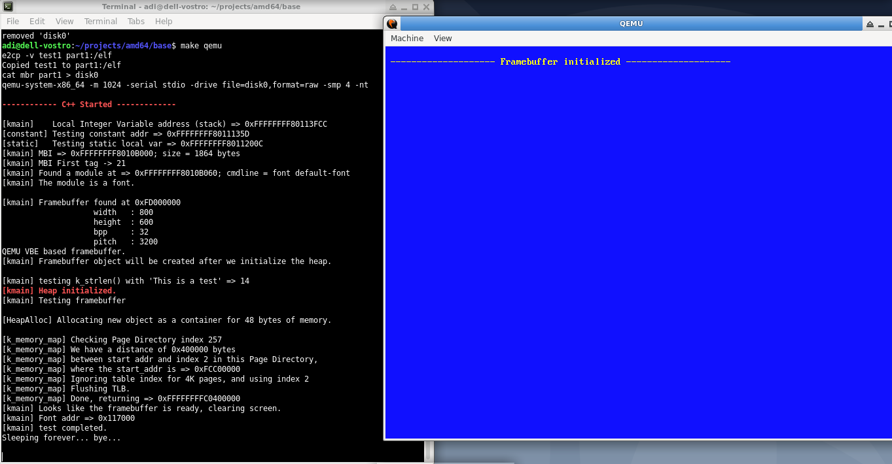

# knos
That name stands for K is Not an OS :)
It's because I use to follow a bunch of tutorials on writing an OS kernel (mostly on OSDEV), and almost all of them
use 'k' as prefix in here and there, then I eventually feel tired reading the keyword OS everywhere
around, so I've decided to write something that's not meant to be an OS, nor a 'kernel', rather than
just a collection of codes running in kernel level.

That's all about it.

Please do not take me seriously, it's probably not going to be any kind of famous anyway.

But it is now using mostly QEMU's serial device to output debugging messages, rather than using
'standard' VGA/Text console, which in my opinion should not be used any further (will not work on
UEFI based machines).

Added Framebuffer tag to boot.s, requested 800x600 @32 fbdev.
Needless to say, also change some codes in boot.s to include another table (empty and not-present), but
the entry in Page Directory Pointer already added to index 511, so it will use 0xFFFFFFFFC0000000 as the
base.

Surely we can make the fbdev larger, but QEMU will create a large (but still empty) 'monitor' covering up
all the screen, and rather annoying for me (it's only meant for testing anyway).

Changes today:
  - Draw text to graphical framebuffer, instead of VGA.
  - Add lat9-16.psf font as GRUB2 module, use it as default font.
  - Modify the equation to calculate vaddr (also write a useful perl script for this).
  
 Calculate the Page Directory index for 2 MB pages using the following:
 
 ```cpp
 
size_t last_bits = 0xffff; // 16 unused bits
size_t start_p4  = (vaddr >> 39) & 0x1ff;
size_t start_pdp = (vaddr >> 30) & 0x1ff;
uintptr_t start_vaddr = (last_bits << 48) | (start_p4 << 39) | (start_pdp << 30);

size_t distance  = vaddr - start_vaddr;  // in bytes
size_t page_diff = distance / 0x200000;  // in pages (2 MB each)

// in this case, page_diff is the new_index for 2 mb pages.

```

To play around with vaddr and page table indexes, I just write a simple PERL script as follow:

```perl

print "Virtual Address (in hex): ";

$strTest = <STDIN>;
$vaddr = hex $strTest;
print "Bytes => " .$vaddr ."\n";

$last_bits = 0xffff;
$start_p4  = ($vaddr >> 39) & 0x1ff;
$start_pdp = ($vaddr >> 30) & 0x1ff;

$start_vaddr = ($last_bits << 48) | ($start_p4 << 39) | ($start_pdp << 30);

printf("Start virtual address for this group => 0x%X\n", $start_vaddr);

$distance = $vaddr - $start_vaddr;
printf("Distance from start vaddr => %llu bytes\n", $distance);

$page_directory_index = $distance / 0x200000;
printf("Page Directory index for 2 MB pages should be: %llu\n", $page_directory_index);
printf("At PML4 Table index %llu\nPDP index %llu\nFrame 0x%X\n", 
	($vaddr >> 39) & 0x1ff,
	($vaddr >> 30) & 0x1ff,
	$vaddr & 0xfff);


```

:)


