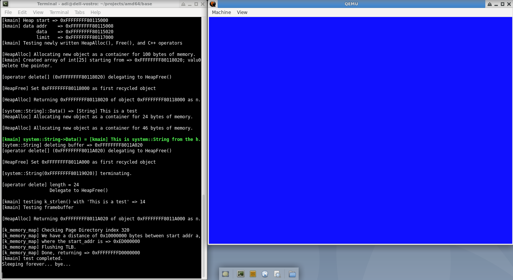

# knos
That name stands for K is Not an OS :)
It's because I use to follow a bunch of tutorials on writing an OS kernel (mostly on OSDEV), and almost all of them
use 'k' as prefix in here and there, then I eventually feel tired reading the keyword OS everywhere
around, so I've decided to write something that's not meant to be an OS, nor a 'kernel', rather than
just a collection of codes running in kernel level.

That's all about it.

Please do not take me seriously, it's probably not going to be any kind of famous anyway.

But it is now using mostly QEMU's serial device to output debugging messages, rather than using
'standard' VGA/Text console, which in my opinion should not be used any further (will not work on
UEFI based machines).

Added Framebuffer tag to boot.s, requested 800x600 @32 fbdev.
Needless to say, also change some codes in boot.s to include another table (empty and not-present), but
the entry in Page Directory Pointer already added to index 511, so it will use 0xFFFFFFFFC0000000 as the
base.

Surely we can make the fbdev larger, but QEMU will create a large (but still empty) 'monitor' covering up
all the screen, and rather annoying for me (it's only meant for testing anyway).

:)

